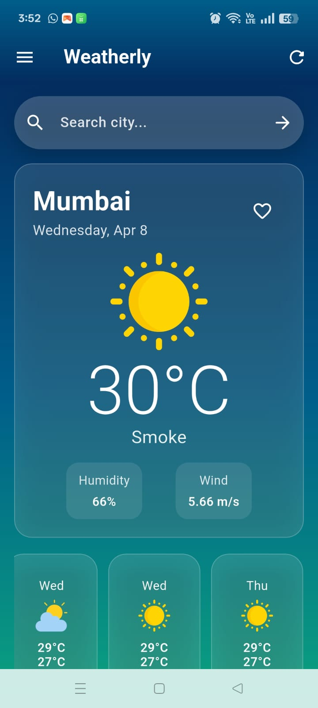
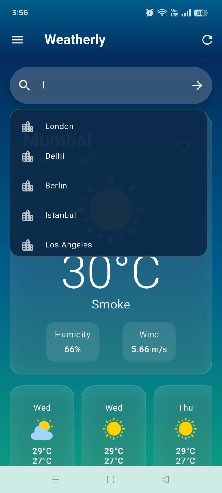
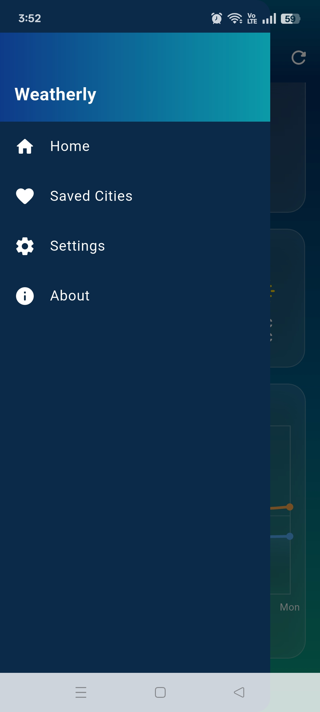
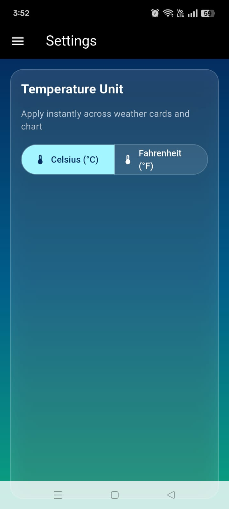
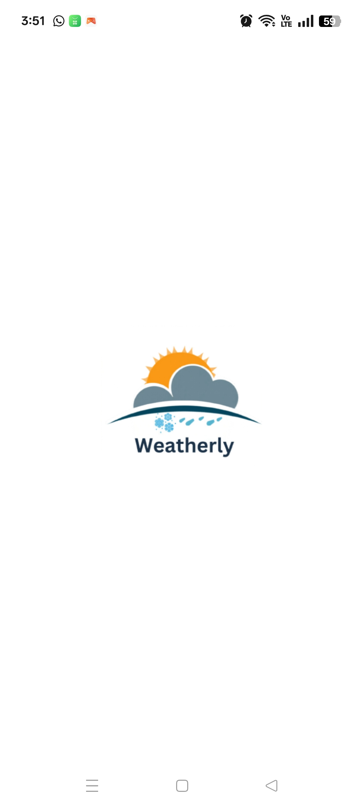

# 🌦 Weatherly - Flutter Weather App

Weatherly is a clean and modern Flutter weather application that shows real-time weather data.

## 🚀 About the Project
This app was built using Flutter with AI-assisted development using Cursor AI.

## ✨ Features
- 🌍 Search weather by city
- 🌡 Real-time temperature data
- ❤️ Save favorite cities
- 🎨 Clean and responsive UI

## 🛠 Tech Stack
- Flutter
- Dart
- REST API
- Provider

<<<<<<< HEAD

## 📸 Screenshots

## 👨‍💻 Developer
Burhanuddin Shaikh

